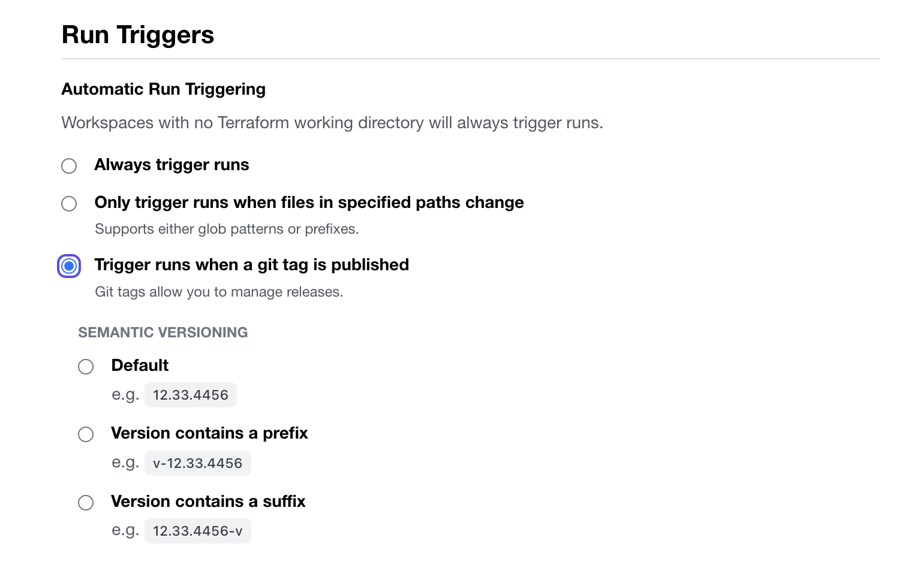

## Git Tags

### Enable `Run Trigger on Git Tags`


### 1) Make and commit code change

### 2) Create and push tag

```
$ git tag v1.0.1
$ git push --tags
```

### 3) Repeat Step 1 & 2 to trigger run
